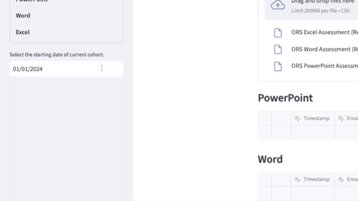
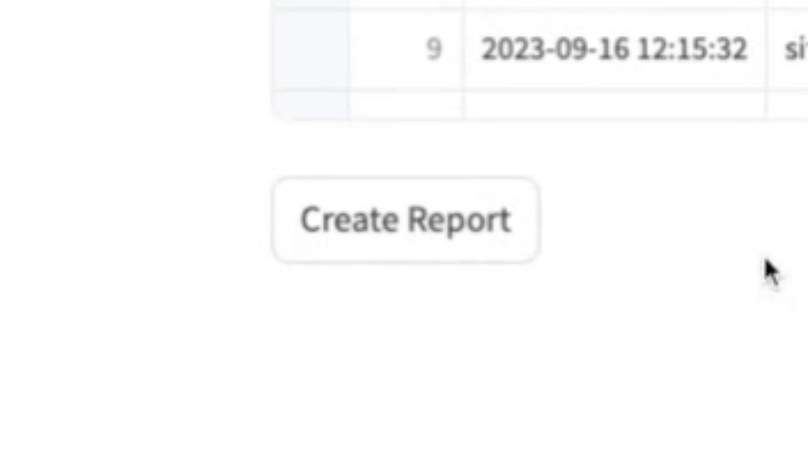
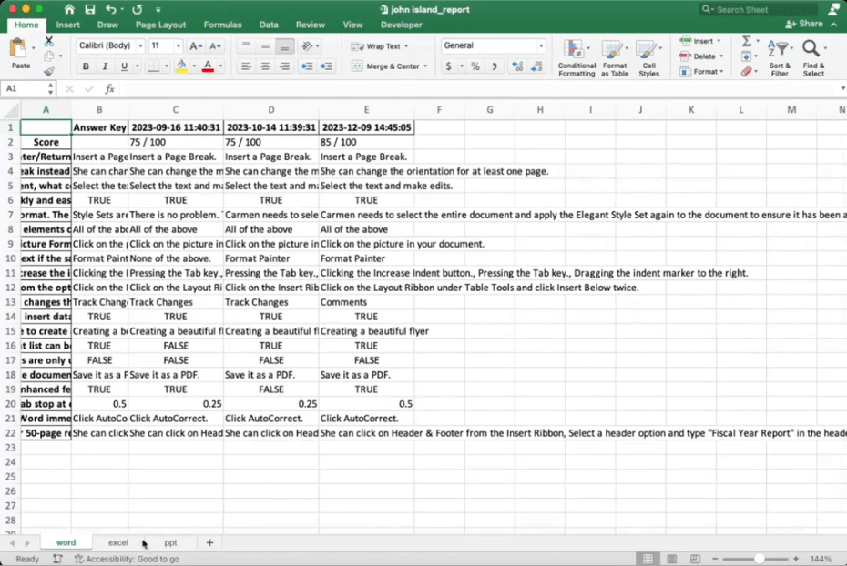

# ORS Auto Grader
Provide CSV file containing student information as well as assessment responses to automatically get the grades of all the students in your ORS section in their individual Excel file.

## Steps:
1. Download CSV files
   - Student Information: `ex. FY24 ORS Attendance Sheet`
   - Assessment Responses: `ex. ORS Word Assessment (Responses), ORS Excel Assessment (Responses), ORS PowerPoint Assessment (Responses)`
2. Open [AutoGrader](https://nypl-ors-autograder.streamlit.app/) app
3. Upload student information CSV file to `Section Information` tab
    
4. Select your section of ORS
    
5. Edit student information if there are mistakes
    
6. Upload assessment responses to `Assessment Grader` tab
    
7. Select starting date of current ORS to filter data
    
8. Check assessment data and edit if needed
9. Scroll down and click `Create Report` button to generate Excel Report for each student
    
10. Click `Download Reports` button to download all the reports in a zip file
11. Unzip file to see all the excel reports
12. Double check the excel files to see if there are any mistakes
    
    - The file name should look something like this:  
        `<firstname> <lastname>_report.xlsx`
    - There should be one sheet for each Microsoft program if student have taken at least the pre-class assessments
    - Each sheet will have the questions on `column A`, answer key on `column B`, and all the assessments from `column C` onwards
    - `row 1` is the timestamp of each assessment, `row 2` is the score, and `row 3` onwards are the questions and responses
13. Write a email template and send out email individually with the individual reports attached, or use mail merge to speed up the process

## Issues (upcoming fixes):
1. Excel formulas showing the value instead of the formula